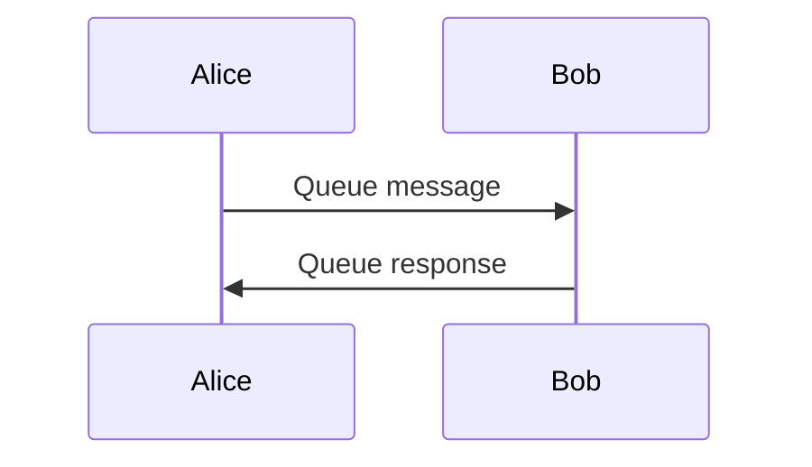

# Mermaid Next Plugin

[](LICENSE)
[](https://obsidian.md)

An [Obsidian](https://obsidian.md) plugin that renders Mermaid diagrams using the latest version of Mermaid — independent of whatever version Obsidian ships with.

## Why

Obsidian bundles its own copy of Mermaid that lags behind upstream releases. New diagram types, syntax improvements, and bug fixes in Mermaid aren't available until Obsidian ships an update — which can take months.

This plugin solves that by loading Mermaid independently, so you always have access to the latest features.

## How it works

Use `mermaid-next` code blocks instead of `mermaid`.

By default the plugin loads Mermaid from jsDelivr CDN. If the CDN is unreachable (offline use), it falls back to a bundled copy of Mermaid included in the plugin. Diagrams are automatically themed using Obsidian's active colour scheme, including support for light and dark mode.

## Usage

````markdown

````

Any valid Mermaid syntax works — flowcharts, sequence diagrams, class diagrams, and more.

## Settings

| Setting | Default | Description |
| --- | --- | --- |
| **Mermaid source** | CDN | `CDN` loads the version from jsDelivr. `Bundled` uses the copy shipped with the plugin (works offline). |
| **Mermaid version** | `latest` | CDN only. Use `latest` or pin a specific version like `11.4.1`. |

> Reload the plugin (disable and re-enable) after changing these settings.

## Installation

### Community plugin store

Search for **Mermaid Next Plugin** in Settings → Community plugins.

### Manual

Copy `main.js`, `styles.css`, and `manifest.json` to your vault at `.obsidian/plugins/mermaid-next/`.

## Scope

This plugin does one thing: render `mermaid-next` code blocks with a current version of Mermaid. No additional features are planned. This scope is intentional — keeping it narrow means low maintenance and long-term stability.

Bug fix PRs are welcome.

## License

[MIT](LICENSE) © 2026 Nasser Alansari
