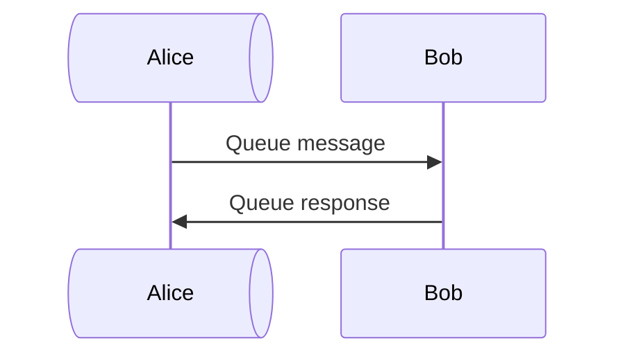

# Mermaid Next _(obsidian plugin)_

[](LICENSE)
[](https://obsidian.md)

Renders Mermaid diagrams using the latest version, independent of the built-in bundled version.

An [Obsidian](https://obsidian.md) plugin that registers a `mermaid-next` code block and renders it with a current build of [Mermaid](https://mermaid.js.org), sourced either from a bundled copy or from the jsDelivr CDN.

## Table of Contents

- [Background](#background)
- [Install](#install)
- [Usage](#usage)
- [Settings](#settings)
- [Scope](#scope)
- [Maintainer](#maintainer)
- [Contributing](#contributing)
- [License](#license)

## Background

Obsidian bundles its own copy of Mermaid that lags behind upstream releases. New diagram types, syntax improvements, and bug fixes added to Mermaid aren't available in Obsidian until the next app update — which can take months.

This plugin loads Mermaid independently of Obsidian, so new diagram features are usable as soon as Mermaid ships them.

## Install

### Community plugin store

Search for **Mermaid Next** in Settings → Community plugins, then enable it.

### Manual

Copy `main.js`, `styles.css`, and `manifest.json` into your vault at `.obsidian/plugins/mermaid-next/`, then enable the plugin in Settings → Community plugins.

### Dependencies

None for end users — the bundled copy of Mermaid ships inside `main.js`. For development, see [Contributing](#contributing).

## Usage

Use `mermaid-next` as the code block language:

````markdown

````

Any valid Mermaid syntax works — flowcharts, sequence diagrams, class diagrams, mindmaps, and more.

## Settings

Changes apply on the next render — no plugin reload required.

| Setting | Default | Description |
| --- | --- | --- |
| **Source** | Bundled | `Bundled` uses the copy shipped with the plugin (offline, fixed version). `CDN` loads from jsDelivr. |
| **Version** | `latest` | CDN only. Use `latest` or pin a specific version like `11.15.0`. |
| **CDN cache** | empty | Manual `Download` button caches the selected CDN version locally for offline use. `Clear cache` removes it. |
| **Obsidian theme integration** | on | When enabled, diagrams follow the active Obsidian theme. When disabled, Mermaid uses its `default` theme. |
| **ELK layout engine** | on | Uses [ELK](https://github.com/eclipse/elk) as the default layout engine. Produces better results for complex flowcharts. |
| **Hand-drawn look** | off | Renders diagrams with a sketched, hand-drawn style. |
| **Replace Obsidian's Mermaid** | off | Swaps `window.mermaid` so all built-in ` ```mermaid``` ` blocks across Obsidian also use this plugin's version. May conflict with other plugins that modify Mermaid. |

## Scope

This plugin's core job: render `mermaid-next` code blocks with a current version of Mermaid. An opt-in setting extends that coverage to plain `mermaid` blocks too (see Settings). No further features are planned. This narrow scope is intentional — low maintenance, long-term stability.

## Maintainer

- [Nasser Alansari](https://github.com/dacrystal)

## Contributing

Questions and bug reports: open an issue on [GitHub](https://github.com/dacrystal/obsidian-mermaid-next-plugin/issues).

Bug fix PRs are welcome. Feature PRs that expand scope beyond rendering `mermaid-next` blocks are unlikely to be merged — see [Scope](#scope).

Development:

```sh
bun install
bun run dev    # watch build
bun run build  # production build + typecheck
bun run lint
```

No sign-off or CLA required.

## License

[MIT](LICENSE) © Nasser Alansari
