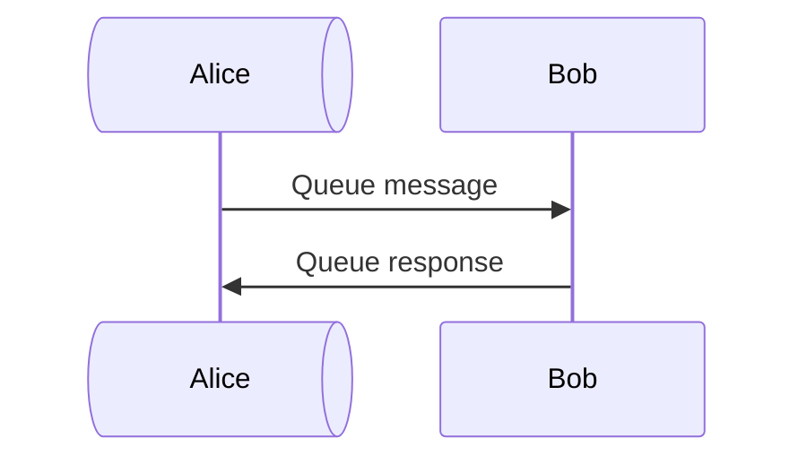
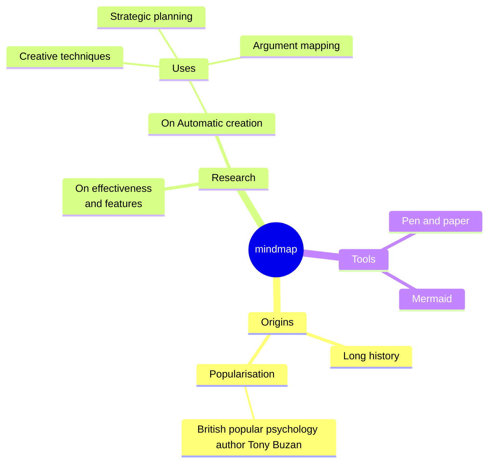
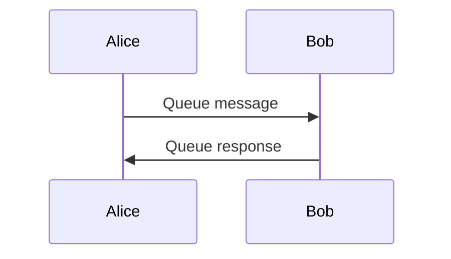
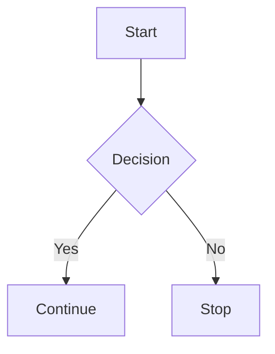

```mermaid-next
---
config:
  layout: elk
  look: handDrawn

---

sequenceDiagram
    participant Alice@{ type: "queue" }
    participant Bob
    Alice->>Bob: Queue message
    Bob->>Alice: Queue response

```

```mermaid-next
mindmap
  root((mindmap))
    Origins
      Long history
      ::icon(fa fa-book)
      Popularisation
        British popular psychology author Tony Buzan
    Research
      On effectiveness<br/>and features
      On Automatic creation
        Uses
            Creative techniques
            Strategic planning
            Argument mapping
    Tools
      Pen and paper
      Mermaid


```

```mermaid
sequenceDiagram
    participant Alice
    participant Bob
    Alice->>Bob: Queue message
    Bob->>Alice: Queue response

```

```mermaid-next
flowchart TB
  A[Start] --> B{Decision}
  B -->|Yes| C[Continue]
  B -->|No| D[Stop]

```
